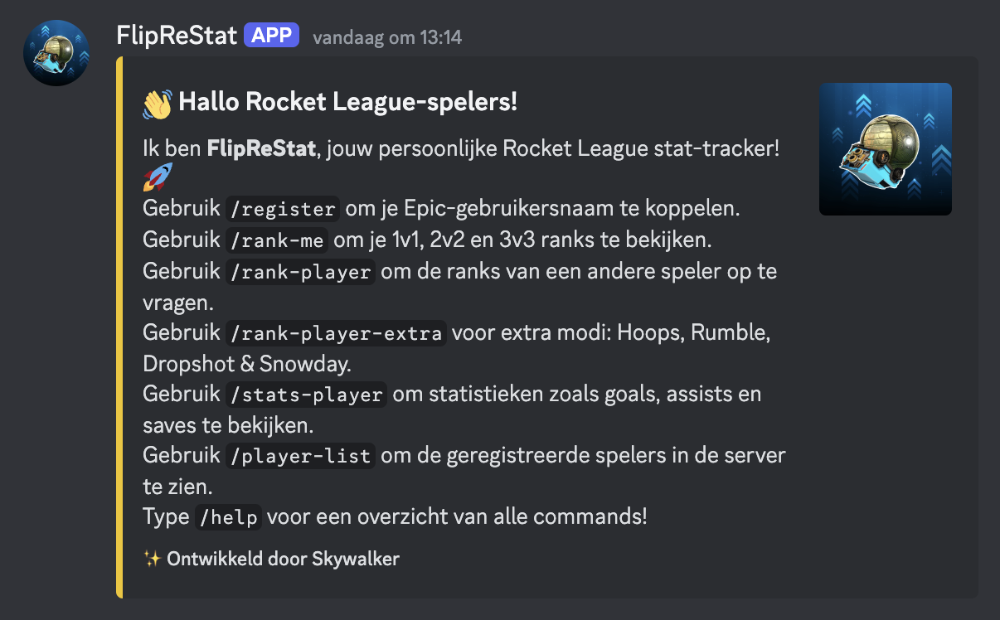

# 🚀 FlipReStat - A Rocket League Stat-Tracking Discord Bot  

FlipReStat is a Discord bot that retrieves Rocket League stats directly in your server using web scraping and proxies. It allows players to check their ranks, track stats, and view leaderboard information—all within Discord!  



## 📌 Features  

FlipReStat allows you to track Rocket League stats with simple commands:  

### 📊 Commands 
- 🔗 **`/register`** – Link your Epic username to your Discord account.  
- 🎮 **`/rank-me`** – View your ranks in 1v1, 2v2, and 3v3.  
- 🔍 **`/rank-player`** – Check the ranks of another player.  
- 🎭 **`/rank-player-extra`** – View ranks for extra modes: Hoops, Rumble, Dropshot & Snowday.   
- ⚽ **`/stats-player`** – See goals, assists, MVPs, saves, and shots.  
- 📝 **`/player-list`** – Get a list of registered players.  
- 📚 **`/help`** – Display all available commands and how to use them.  

## 🛠️ Technical Overview  

FlipReStat leverages the following technologies:  

*   **Discord.py** – The core library for interacting with the Discord API.  
*   **Cloudscraper** – A web scraping library used to bypass bot protection and retrieve data from the Rocket League Tracker Network.  
*   **Proxies** – Used to avoid rate limits and improve request reliability.  
*   **Fake User Agent** – Rotates user agents to prevent detection and blocking.  
*   **JSON** – Stores and retrieves user data efficiently.  

## 🛠️ Setup & Configuration  

### 1⃣ Prerequisites  
- Python 3.9+  
- A registered Discord bot token  
- An Epic Games account (for linking ranks)  

### 2⃣ Clone the repository  
```sh  
git clone https://github.com/yourusername/FlipReStat.git  
cd FlipReStat  
```

### 3⃣ Install dependencies  
```sh  
pip install -r requirements.txt  
```

### 4⃣ Create a `.env` file and configure your credentials  
Create a `.env` file in the root directory and add:  
```ini  
DISCORD_TOKEN=your-discord-bot-token  
PROXY_USERNAME=your-proxy-username  
PROXY_PASSWORD=your-proxy-password  
```

### 5⃣ Run the bot  
```sh  
python main.py  
```

## 📌 Notes  

- Unfortunately, there is no free public Rocket League API available.  
- FlipReStat uses **Cloudscraper + Proxies** to retrieve stats from Rocket League Tracker Network.  
- Usernames, passwords, and Discord tokens should always be stored securely in a `.env` file.  

## 🎯 About This Project  

This is my **first real programming project**, built over **two weeks of trial and error**.  
Be gentle about the way I coded this, there is probably lot's of improvement to be made. 🚀  

---

✨ **Developed by luukdg**  
